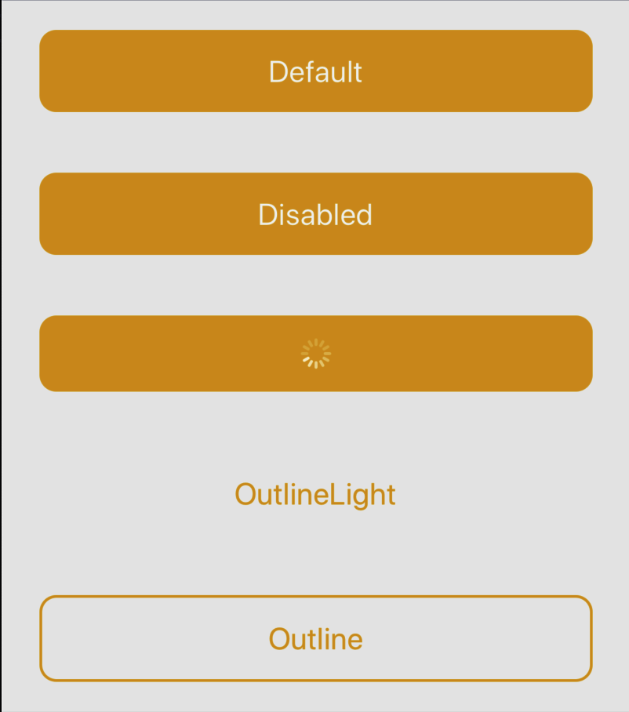
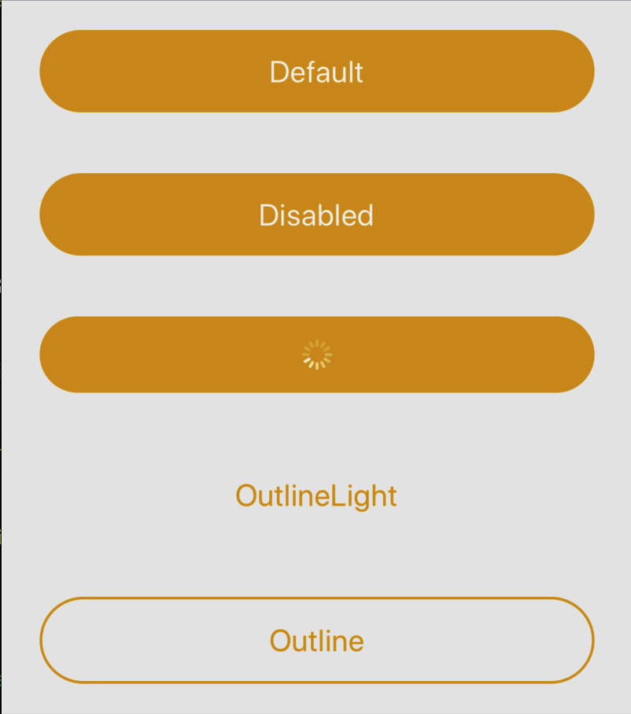

# Dependências

```
yarn add styled-components
```
```
yarn add react-hook-form
```
```
yarn add react-native-vector-icons
```
```
yarn add react-native-text-input-mask
```

## Dependências de desenvolvedor
```
yarn add --dev @types/react-native-vector-icons
```
```
yarn add --dev @types/styled-components
```

# Instruções de instalação das bibliotecas mencionadas

### react-native-vector-icons

Criar arquivos react-native.config.js na raiz do projeto e colar o código
```js
module.exports = {
    dependencies: {
        'react-native-vector-icons': {
            platforms: {
                ios: null,
            },
        },
    },
    project: {
        ios: {},
        android: {},
    },
    assets: ['./src/assets/fonts'],
};
```

#### IOS
Inserir em `podfile` o código abaixo
```
pod 'RNVectorIcons', :path => '../node_modules/react-native-vector-icons'
```

Inserir em `info.plist` o código abaixo
```html
<key>UIAppFonts</key>
<array>
    <string>AntDesign.ttf</string>
    <string>Entypo.ttf</string>
    <string>EvilIcons.ttf</string>
    <string>Feather.ttf</string>
    <string>FontAwesome.ttf</string>
    <string>FontAwesome5_Brands.ttf</string>
    <string>FontAwesome5_Regular.ttf</string>
    <string>FontAwesome5_Solid.ttf</string>
    <string>Foundation.ttf</string>
    <string>Ionicons.ttf</string>
    <string>MaterialIcons.ttf</string>
    <string>MaterialCommunityIcons.ttf</string>
    <string>SimpleLineIcons.ttf</string>
    <string>Octicons.ttf</string>
    <string>Zocial.ttf</string>
</array>
```

### react-native-text-input-mask

#### Android
Inserir em `android/build.gradle`o código
```js
buildscript {
    ext {
        // ...
        kotlin_version = '1.6.10' // <- Adicionar essa linha
    }

    dependencies {
        // ...
        classpath "org.jetbrains.kotlin:kotlin-gradle-plugin:$kotlin_version" // <- Adicionar essa linha
        // ...
    }
}
```

#### IOS
Inserir em `podfile` o código
```js
pod 'React-RCTText', :path => '../node_modules/react-native/Libraries/Text', :modular_headers => true
```

# Uso

## Button

### Propriedades
| Prop | Tipo | Descrição | Requerido |
| :--: | :--: | :--: | :--: |
| onPress | `() => void` | Função que será executada ao clicar | Sim |
| disabled | `boolean` | Indica se o botão poderá ser clicado | Não |
| loading | `boolean` | Indica se o botão está em estado de loading | Não |
| outline | `boolean` | Indica se o estilo `outline` | Não |
| outlineLight | `boolean` | Indica se o estilo `outlineLight` | Não |
| design | `string` | Indica o design `'default'` ou `'minimal'` | Não |

### Exemplo

O botão insere os `children` em um componente de texto internamente, evitando o uso de mais um componente.

```tsx
import React from 'react';
import Button from '../components/Button';

function App() {
    return(
        <Button
            onPress={() => Alert.alert('Alert', 'Alert')}
            design='default'
        >
            Exemplo
        </Button>
    );
}
export default App;
```

#### Imagem de algumas variações
##### Design default


##### Design Minimal

